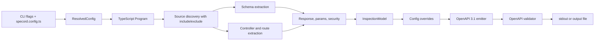

# Phase 2 Real-World NestJS OpenAPI Spec

Date: 2026-05-12
Status: Active Phase 2 contract for V1 release readiness

## Purpose

Phase 2 turns Specord V1 from an extractor spike into a usable NestJS OpenAPI generator.

The target is a NestJS-only, dependency-free Swagger-compatible OpenAPI 3.1 generator. Specord may statically recognize source patterns from NestJS Swagger projects, but Specord packages MUST NOT depend on `@nestjs/swagger`, MUST NOT call `SwaggerModule.createDocument()`, and MUST NOT boot the user's Nest application.

The V1 trust boundary remains source analysis plus explicit config, not runtime execution.

## Product Boundary

### In scope

- NestJS REST controllers and DTOs.
- TypeScript `Program` and `TypeChecker` based extraction.
- Static harvesting for common NestJS Swagger decorators and CLI-plugin metadata.
- OpenAPI 3.1 JSON emission through `specord generate`.
- OpenAPI validation before writing output.
- `specord.config.ts` as the final precision layer.
- Fixture proof against the canonical benchmark:
  - `examples/nestjs-api`

### Out of scope

- Express/Fastify standalone app support.
- Runtime Nest app boot.
- Importing, wrapping, or re-exporting `@nestjs/swagger`.
- YAML output.
- Full decorator/plugin parity with every `@nestjs/swagger` edge case.
- Header and media-type versioning emission when the route cannot be safely expressed as a path.

## Supported Commands

### Inspect

```bash
specord inspect [project-dir]
```

`inspect` emits the internal `InspectionModel`. It is the debugging command and must remain deterministic.

### Generate

```bash
specord generate [project-dir] [--output openapi.json] [--pretty]
```

`generate` emits OpenAPI 3.1 JSON. When `--output` is omitted, JSON is written to stdout. When `--output` is present, Specord validates the document and writes the file only after validation succeeds. `inspect` and `generate` infer `tsconfig.json` and `src/` from the current directory or from an optional project directory argument; `--project` and `--root` remain explicit overrides for custom layouts.

Generation MUST warn and emit by default for unresolved extraction warnings. CI strictness is controlled by config:

- `ci.failOnUnresolved`
- `ci.failOnWarning`
- `ci.failOnInvalid`

Validation errors from the OpenAPI document are always fatal.

## Static Swagger Compatibility

Specord statically recognizes the following source patterns:

| Area | Supported patterns |
| --- | --- |
| Operation metadata | `@ApiTags`, `@ApiOperation` |
| Responses | `@ApiResponse`, `@ApiOkResponse`, `@ApiCreatedResponse`, `@ApiAcceptedResponse`, `@ApiNoContentResponse`, common 4xx/5xx variants |
| Security | `@ApiBearerAuth`, `@ApiSecurity` |
| Properties | `@ApiProperty`, `@ApiPropertyOptional`, `@ApiResponseProperty` |
| Mapped types | `PartialType`, `PickType`, `OmitType`, `IntersectionType` |
| Plugin metadata | static `_OPENAPI_METADATA_FACTORY()` object literals |

Static harvesting MUST be literal-only. Unsupported expressions should not be executed. When a pattern cannot be resolved safely, the extractor should preserve valid output and emit an actionable diagnostic.

## Inference Precedence

All output follows this precedence:

1. `specord.config.ts`
2. Swagger decorators and static plugin metadata
3. TypeScript and class-validator inference
4. Diagnostics

## Architecture



## OpenAPI Emission Contract

The emitter MUST produce:

- `openapi: "3.1.0"`
- `info`
- optional `servers`
- optional `tags`
- `paths`
- operations with stable `operationId`
- parameters
- request bodies
- responses
- `components.schemas`
- `components.securitySchemes` when configured

Schema emission MUST translate internal refs to OpenAPI component references and preserve Swagger/config metadata such as descriptions, examples, enums, formats, deprecation, read/write flags, nullable, and validator constraints.

If an internal `SchemaRef` points to a schema name that is not present in `InspectionModel.schemas`, the emitter MUST NOT output a dangling component `$ref`. It should emit an unconstrained schema object (`{}`) so the OpenAPI document remains valid, while diagnostics/config remain the precision path for unsupported source shapes such as type aliases or Zod-inferred bodies.

## Routing Contract

- `routing.globalPrefix` prefixes emitted paths.
- `routing.versioning.strategy: "uri"` prefixes emitted paths with `v<value>` unless the value already starts with `v`.
- `header` and `media-type` versioning produce `EXTRACTOR_UNSUPPORTED_VERSIONING` because V1 does not have enough static route information to express them safely.

## Fixture Acceptance Matrix

| Fixture | Required result |
| --- | --- |
| `examples/nestjs-api` | Deterministic inspect behavior remains green against the production benchmark fixture. |
| `examples/nestjs-api` | Generate emits valid OpenAPI 3.1 JSON despite unresolved warnings. |
| `examples/nestjs-api` | Swagger decorators are harvested for tags, operation ids, descriptions, responses, and security requirements. |
| `examples/nestjs-api` | DTO property decorators enrich component schemas. |
| `examples/nestjs-api` | Nested routes, query DTOs, and common mapped type compositions resolve deterministically. |
| `examples/nestjs-api` | Auth decorators produce operation security requirements without requiring `@nestjs/swagger` as a Specord dependency. |
| `examples/nestjs-api` | Deliberately unresolved response/security cases warn by default and fail when strict CI config requires it. |

## Diagnostics

Phase 2 extends the V1 catalog with:

| Code | Severity | Trigger | Suggested fix |
| --- | --- | --- | --- |
| `EXTRACTOR_UNSUPPORTED_VERSIONING` | warning | Header or media-type versioning configured | Use URI versioning for V1 or document via config |

Diagnostics now may include `origin` to identify whether the uncertainty came from TypeScript, NestJS, Swagger compatibility, config, or OpenAPI emission.

## Release Readiness Bar

V1 is release-ready only when:

- Package tests pass for `@specord/core`, `@specord/openapi`, and `@specord/cli`.
- Workspace `pnpm test` passes.
- Workspace `pnpm build` passes.
- Canonical inspect works for `examples/nestjs-api`.
- Generate emits validated OpenAPI 3.1 JSON for both NestJS fixtures.
- Docs clearly explain the no-Swagger-dependency compatibility stance.
- `reports/phase-2.md` records fixture results, diagnostics, generated output summary, risks, and next roadmap.
