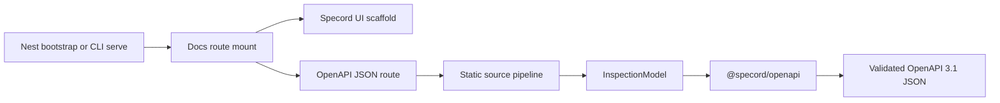

# Phase 3 Dev Docs Runtime Spec

Date: 2026-05-13
Status: Active Phase 3 developer-experience contract

## Purpose

Phase 3 makes generated OpenAPI output visible during local development without changing the Phase 2 extraction trust boundary.

Specord now has two documentation surfaces:

1. A NestJS route-injection helper, similar in usage shape to `SwaggerModule.setup()`.
2. A standalone CLI docs server for projects that want to view generated docs without modifying the app bootstrap yet.

Both surfaces serve the same generated OpenAPI 3.1 document and the same lightweight UI scaffold.

## Product Boundary

### In scope

- `@specord/nestjs` exports `setupSpecordDocs(app, options)`.
- The Nest helper injects docs routes into an existing Nest app during bootstrap.
- The default docs route is `/api`.
- The default OpenAPI route is `/api/openapi.json`.
- Both routes are overridable.
- A caller may provide a prebuilt OpenAPI document or document factory.
- If no document is provided, Specord generates from source using the same static pipeline as `specord generate`.
- Generated or factory-provided documents are cached per mounted docs instance by default; callers may disable this when they need rebuild-on-refresh behavior.
- `specord serve` serves the docs UI and OpenAPI JSON independently of a Nest app.
- `specord serve` may optionally start a user-provided app command beside the docs server.
- `specord serve` binds to loopback by default and refuses non-loopback hosts unless network access is explicit.
- The UI is a scaffold only: document summary, operation list, and link to the JSON document.

### Out of scope

- Full API reference interaction design.
- Try-it-out execution.
- Request auth storage.
- Runtime Swagger generation.
- Booting or introspecting the Nest app to create the OpenAPI document.
- Replacing `@nestjs/swagger` in apps that still want Swagger's runtime behavior.

## Nest Route Injection Contract

Usage:

```ts
import { NestFactory } from "@nestjs/core";
import { setupSpecordDocs } from "@specord/nestjs";
import { AppModule } from "./app.module";

async function bootstrap() {
  const app = await NestFactory.create(AppModule);

  setupSpecordDocs(app);

  await app.listen(process.env.PORT ?? 3000);
}

bootstrap();
```

Defaults:

| Route | Purpose |
| --- | --- |
| `/api` | Docs UI scaffold |
| `/api/openapi.json` | Generated OpenAPI 3.1 JSON |

Overridden route example:

```ts
setupSpecordDocs(app, {
  path: "/reference",
  jsonPath: "/reference/spec.json",
});
```

Explicit source example:

```ts
setupSpecordDocs(app, {
  project: "tsconfig.json",
  root: "src",
});
```

Document factory example:

```ts
setupSpecordDocs(app, {
  document: () => cachedOpenApiDocument,
});
```

Disable per-instance caching:

```ts
setupSpecordDocs(app, {
  cacheDocument: false,
});
```

## Standalone Serve Contract

Usage:

```bash
specord serve [project-dir] [--host 127.0.0.1] [--port 4777]
```

Defaults:

| Route | Purpose |
| --- | --- |
| `/` | Redirects to `/api` |
| `/api` | Docs UI scaffold |
| `/api/openapi.json` | Generated OpenAPI 3.1 JSON |
| `/health` | Server health JSON |

Connected app process example:

```bash
specord serve apps/api --app-command "pnpm start:dev" --app-url http://localhost:3000
```

`--app-command` is only orchestration. It does not influence extraction and does not make Specord inspect runtime Nest state.

By default, `specord serve` caches the generated OpenAPI document after the first successful JSON request. Use `--no-cache` to rebuild on every JSON request during source-edit debugging.

The docs server defaults to `127.0.0.1`. Binding to hosts such as `0.0.0.0` or LAN addresses requires `--allow-public-host`.

## Architecture



## Release Readiness Bar

- `@specord/ui` tests cover escaped UI rendering.
- `@specord/nestjs` tests cover default `/api` injection and route overrides.
- `@specord/nestjs` tests cover document caching and cache opt-out.
- `@specord/cli` tests cover independent docs serving, cached JSON serving, loopback-only host protection, and optional app command spawning.
- Workspace tests and builds pass.
- Browser check verifies the served scaffold renders and loads `/api/openapi.json`.
